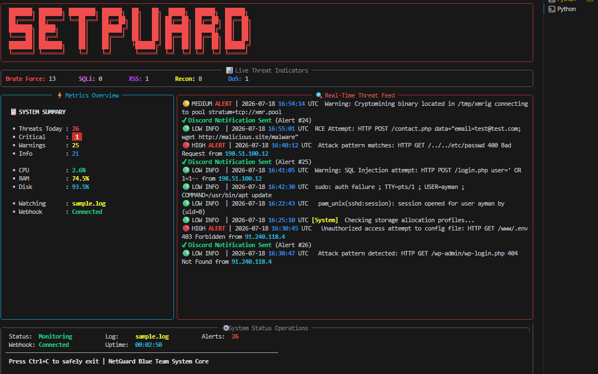
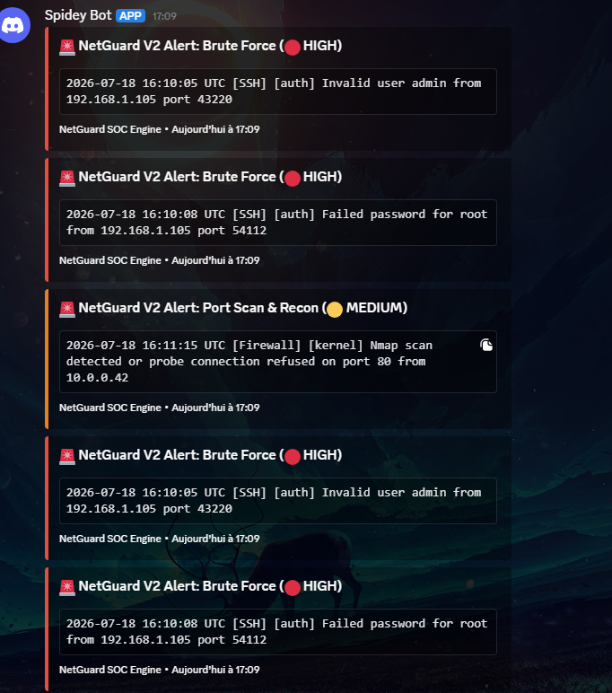

<div align="center">

# 🛡️ NetGuard V2

### Advanced Infrastructure Security Dashboard

Enterprise-grade Blue Team tool for monitoring Linux infrastructure, detecting cyber threats, and visualizing system health in real-time through an interactive terminal dashboard.


</div>

---

# 📖 Table of Contents

- Overview
- Preview
- Features
- Architecture
- Discord Alerting
- Installation
- Usage
- Detection Engine
- Project Structure
- Roadmap
- Tech Stack
- Author

---

# 📖 Overview

NetGuard V2 is a real-time Linux security monitoring platform built for Blue Team operations.

It combines:

- 🔍 Live Threat Detection
- 📊 Infrastructure Monitoring
- 🚨 Discord Alerting
- 🖥 Rich Terminal Dashboard

into one lightweight security monitoring solution.

Unlike traditional log viewers, NetGuard continuously analyzes incoming logs, detects malicious activity, monitors server resources, and immediately notifies administrators through Discord.

---

# 📸 Preview

## 🖥 Main Dashboard



---

## 🚨 Discord Notification



---

# ✨ Features

## 🔐 Threat Detection

- SSH Brute Force
- Failed Authentication Attempts
- SQL Injection (SQLi)
- Cross-Site Scripting (XSS)
- Directory Traversal
- Web Shell Detection
- Remote Code Execution (RCE)
- Log4Shell Indicators
- Nmap Detection
- Port Scan Detection
- DoS Indicators
- Crypto Miner Detection

---

## 📊 Infrastructure Monitoring

- Live CPU Monitoring
- Live RAM Monitoring
- Live Disk Usage
- Color-coded Health Status
- Continuous Resource Updates

---

## 🚨 Discord Alerting

NetGuard V2 instantly sends security alerts to Discord using Webhooks.

Each notification contains:

- Threat Type
- Severity Level
- Source IP
- Timestamp
- Detection Module
- Original Log Entry

### Benefits

- Instant Incident Response
- Remote Monitoring
- Team Collaboration
- Mobile Notifications
- 24/7 Alerting

---

# 🏗 Architecture

```
                Linux Log File
                       │
                       ▼
             Log Streaming Engine
                       │
                       ▼
            Regex Detection Engine
                       │
          ┌────────────┴────────────┐
          ▼                         ▼
 Rich Terminal Dashboard     Discord Webhook
```

---

# ⚙️ Installation

```bash
git clone https://github.com/webixly/Netguard-V2.git

cd Netguard-V2

pip install -r requirements.txt
```

---

# 🚀 Usage

Analyze a sample log:

```bash
python netguard.py --watch sample.log
```

Analyze a production log:

```bash
python netguard.py --watch /var/log/auth.log
```

---

# 📂 Project Structure

```
Netguard-V2/

├── core/
│   ├── log_watcher.py
│   ├── monitor.py
│   └── scanner.py
│
├── ui/
│   └── display.py
│
├── images/
│
├── requirements.txt
├── sample.log
└── netguard.py
```

---

# ⚡ Detection Engine

| Category | Detection |
|-----------|-----------|
| Authentication | SSH Brute Force |
| Authentication | Failed Password |
| Web | SQL Injection |
| Web | XSS |
| Web | Directory Traversal |
| Exploitation | Remote Code Execution |
| Malware | Web Shell |
| Malware | Log4Shell |
| Reconnaissance | Nmap Scan |
| Network | Port Scan |
| Infrastructure | DoS Indicators |
| Malware | Crypto Mining |

---

# 🌍 Real-World Use Cases

- Linux Server Monitoring
- Security Operations Centers (SOC)
- Blue Team Labs
- VPS Monitoring
- Home Labs
- Security Training
- Infrastructure Auditing

---

# 📈 Roadmap

- [x] Threat Detection Engine
- [x] Infrastructure Monitoring
- [x] Discord Webhook Alerts
- [ ] Automatic IP Blocking
- [ ] Multi-Log Monitoring
- [ ] Email Notifications
- [ ] Telegram Notifications
- [ ] Web Dashboard
- [ ] SIEM Integration
- [ ] AI Threat Classification

---

# 🛠 Tech Stack

- Python
- Rich
- Psutil
- Requests
- Regex
- Linux Log Monitoring
- Discord Webhooks

---

# 📄 License

This project is released under the MIT License.

---

# 👨‍💻 Author

## Ayman

**Blue Team • Infrastructure Security • Python Developer**

GitHub:

https://github.com/webixly

---

<div align="center">

⭐ If you find this project useful, consider giving it a star.

</div>
